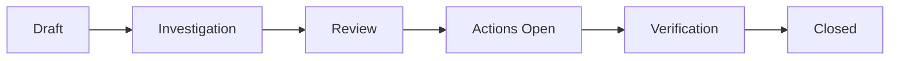

## Overview

The RCA (Root Cause Analysis) module provides structured investigation tools including 5 Whys, Logic Tree, and Fishbone (Ishikawa) diagram templates. All RCA data is stored in browser `localStorage`.

<Note>
  The RCA module stores data locally in the browser, not via the backend API. This means RCA records are device-specific and not synchronized across users.
</Note>

---

## RcaRecord

Main type representing a complete Root Cause Analysis investigation.

```typescript
export interface RcaRecord {
  id: string;
  rcaId?: string;
  title: string;
  template?: RcaTemplateType;
  problemStatement?: string;
  nodes: RcaChartNode[];
  edges: RcaChartEdge[];
  status?: RcaStatus;
  statusHistory?: RcaStatusHistoryItem[];
  
  // Header fields
  assetId?: string;
  assetName?: string;
  departmentId?: string;
  departmentName?: string;
  eventDate?: string;
  initiatedAt?: string;
  initiatedById?: string;
  initiatedByName?: string;
  rcaLeaderId?: string;
  rcaLeaderName?: string;
  severityLevel?: RcaActionPriority;
  productionImpactHours?: number;
  estimatedCostImpact?: number;
  
  // Failure modes and root causes
  failureModeIds?: string[];
  failureModes?: RcaFailureModeRef[];
  rootCauseIds?: string[];
  rootCauses?: RcaRootCauseRef[];
  
  // Template-specific data
  rca5WhysEntries?: Rca5WhysEntry[];
  fishboneEntries?: RcaFishboneEntry[];
  
  // Actions and solutions
  actions?: RcaAction[];
  solutions?: RcaSolutionItem[];
  
  // Additional details
  evidence?: RcaEvidenceItem[];
  problemStatementDetails?: RcaProblemStatement;
  finalReport?: RcaFinalReport;
  
  // Legacy fields
  mapLocation?: string;
  severity?: string;
  groups?: string;
  notes?: string;
  types?: string;
  tags?: string;
  owner?: string;
  facilitator?: string;
  teamMembers?: string[];
  
  createdAt: string;
  updatedAt: string;
}
```

### Core Fields

<ResponseField name="id" type="string" required>
  Unique identifier for the RCA record
</ResponseField>

<ResponseField name="rcaId" type="string">
  Display ID in format `RCA-YYYY-XXXX` (e.g., "RCA-2024-0001")
</ResponseField>

<ResponseField name="title" type="string" required>
  Title of the investigation
</ResponseField>

<ResponseField name="template" type="RcaTemplateType">
  Investigation method: `"5whys"`, `"logic-tree"`, or `"fishbone"`
</ResponseField>

<ResponseField name="problemStatement" type="string">
  Brief problem statement
</ResponseField>

<ResponseField name="nodes" type="RcaChartNode[]" required>
  Array of nodes in the RCA diagram (see RcaChartNode type below)
</ResponseField>

<ResponseField name="edges" type="RcaChartEdge[]" required>
  Array of edges connecting nodes (see RcaChartEdge type below)
</ResponseField>

<ResponseField name="status" type="RcaStatus">
  Current status: `"Draft"`, `"Investigation"`, `"Review"`, `"Actions Open"`, `"Verification"`, or `"Closed"`
</ResponseField>

<ResponseField name="actions" type="RcaAction[]">
  Array of corrective/preventive actions (see RcaAction type below)
</ResponseField>

---

## RcaTemplateType

Investigation methodology used for the RCA.

```typescript
export type RcaTemplateType = "5whys" | "logic-tree" | "fishbone" | "sologic";
```

<Tabs>
  <Tab title="5 Whys">
    **5 Whys Method**
    
    Iteratively ask "Why?" to drill down to root causes:
    1. Why did the problem occur?
    2. Why did that happen?
    3. Why did that happen?
    4. Why did that happen?
    5. Why did that happen?
    
    Typically reaches root cause within 5 iterations.
  </Tab>
  
  <Tab title="Logic Tree">
    **Logic Tree / Fault Tree Analysis**
    
    Systematic breakdown using logical gates:
    - Hypothesis-driven investigation
    - Evidence-based validation
    - Status tracking: Confirmed, Rejected, Pending
    - Supports complex multi-causal problems
  </Tab>
  
  <Tab title="Fishbone">
    **Fishbone / Ishikawa Diagram**
    
    Categorizes causes using the 6M framework:
    - **Man**: Human factors
    - **Machine**: Equipment issues
    - **Method**: Process problems
    - **Material**: Material defects
    - **Measurement**: Inspection/measurement errors
    - **Environment**: Environmental factors
  </Tab>
</Tabs>

---

## RcaStatus

Lifecycle status of an RCA investigation.

```typescript
export type RcaStatus =
  | "Draft"
  | "Investigation"
  | "Review"
  | "Actions Open"
  | "Verification"
  | "Closed";
```

### Status Workflow



<Steps>
  <Step title="Draft">
    Initial creation, problem statement being defined
  </Step>
  
  <Step title="Investigation">
    Active investigation, building cause-and-effect diagram
  </Step>
  
  <Step title="Review">
    Investigation complete, findings under review
  </Step>
  
  <Step title="Actions Open">
    Corrective actions identified and assigned
  </Step>
  
  <Step title="Verification">
    Actions completed, effectiveness being verified
  </Step>
  
  <Step title="Closed">
    RCA complete, actions verified, lessons learned documented
  </Step>
</Steps>

---

## RcaChartNode

Represents a node (cause, effect, or problem) in the RCA diagram.

```typescript
export interface RcaChartNode {
  id: string;
  type?: string;
  position: { x: number; y: number };
  data: RcaNodeData;
}
```

<ResponseField name="id" type="string" required>
  Unique node identifier
</ResponseField>

<ResponseField name="type" type="string">
  Node type for rendering (implementation-specific)
</ResponseField>

<ResponseField name="position" type="object" required>
  X/Y coordinates for diagram layout
</ResponseField>

<ResponseField name="data" type="RcaNodeData" required>
  Node content and metadata (see RcaNodeData below)
</ResponseField>

---

## RcaNodeData

Data stored in an RCA diagram node.

```typescript
export interface RcaNodeData extends Record<string, unknown> {
  label: string;
  type?: RcaNodeType;
  color?: string;
  solutions?: RcaNodeSolution[];
  hypothesis?: string;
  evidenceStatus?: "Confirmed" | "Rejected" | "Pending";
  supportingEvidence?: string;
}
```

<ResponseField name="label" type="string" required>
  Node label text (the cause, effect, or problem description)
</ResponseField>

<ResponseField name="type" type="RcaNodeType">
  Node classification: `"problem"`, `"why"`, `"cause"`, or `"effect"`
</ResponseField>

<ResponseField name="color" type="string">
  Display color for the node
</ResponseField>

<ResponseField name="solutions" type="RcaNodeSolution[]">
  Solutions attached to this cause node
</ResponseField>

<ResponseField name="hypothesis" type="string">
  Logic Tree: hypothesis statement for this branch
</ResponseField>

<ResponseField name="evidenceStatus" type="'Confirmed' | 'Rejected' | 'Pending'">
  Logic Tree: validation status of this hypothesis
</ResponseField>

<ResponseField name="supportingEvidence" type="string">
  Logic Tree: evidence supporting or refuting the hypothesis
</ResponseField>

---

## RcaChartEdge

Represents a connection between two nodes in the RCA diagram.

```typescript
export interface RcaChartEdge {
  id: string;
  source: string;
  target: string;
}
```

<ResponseField name="id" type="string" required>
  Unique edge identifier
</ResponseField>

<ResponseField name="source" type="string" required>
  ID of the source node
</ResponseField>

<ResponseField name="target" type="string" required>
  ID of the target node
</ResponseField>

---

## RcaAction

Corrective, preventive, or systemic action to address root causes.

```typescript
export interface RcaAction {
  id: string;
  actionType: RcaActionType;
  description: string;
  ownerId?: string;
  ownerName?: string;
  departmentId?: string;
  departmentName?: string;
  dueDate?: string;
  priority: RcaActionPriority;
  status: RcaActionStatus;
  verificationRequired: boolean;
  verifiedById?: string;
  verifiedByName?: string;
  verificationDate?: string;
  effectivenessReviewDate?: string;
  createdAt: string;
}
```

### Fields

<ResponseField name="id" type="string" required>
  Unique action identifier
</ResponseField>

<ResponseField name="actionType" type="RcaActionType" required>
  Type of action: `"Corrective"`, `"Preventive"`, or `"Systemic"`
  
  - **Corrective**: Fixes the immediate problem
  - **Preventive**: Prevents recurrence
  - **Systemic**: Addresses underlying system/process issues
</ResponseField>

<ResponseField name="description" type="string" required>
  Detailed description of the action to be taken
</ResponseField>

<ResponseField name="ownerId" type="string">
  ID of the person responsible for completing the action
</ResponseField>

<ResponseField name="ownerName" type="string">
  Name of the action owner
</ResponseField>

<ResponseField name="departmentId" type="string">
  ID of the department responsible
</ResponseField>

<ResponseField name="departmentName" type="string">
  Name of the responsible department
</ResponseField>

<ResponseField name="dueDate" type="string">
  Target completion date (ISO 8601 format)
</ResponseField>

<ResponseField name="priority" type="RcaActionPriority" required>
  Priority level: `"Low"`, `"Medium"`, `"High"`, or `"Critical"`
</ResponseField>

<ResponseField name="status" type="RcaActionStatus" required>
  Current status: `"Open"`, `"In Progress"`, `"Completed"`, `"Verified"`, or `"Overdue"`
</ResponseField>

<ResponseField name="verificationRequired" type="boolean" required>
  Whether this action requires verification after completion
</ResponseField>

<ResponseField name="verifiedById" type="string">
  ID of the person who verified the action
</ResponseField>

<ResponseField name="verificationDate" type="string">
  Date when action was verified
</ResponseField>

<ResponseField name="effectivenessReviewDate" type="string">
  Date for reviewing action effectiveness
</ResponseField>

---

## Rca5WhysEntry

Table row entry for 5 Whys analysis.

```typescript
export interface Rca5WhysEntry {
  id: string;
  level: number;
  statement: string;
  evidenceReference?: string;
}
```

<ResponseField name="id" type="string" required>
  Unique entry identifier
</ResponseField>

<ResponseField name="level" type="number" required>
  Which "Why" level (1-5)
</ResponseField>

<ResponseField name="statement" type="string" required>
  The answer to "Why?" at this level
</ResponseField>

<ResponseField name="evidenceReference" type="string">
  Reference to supporting evidence
</ResponseField>

---

## RcaFishboneEntry

Entry in a Fishbone diagram categorized by 6M framework.

```typescript
export interface RcaFishboneEntry {
  id: string;
  category: RcaFishboneCategory;
  causeDescription: string;
  evidence?: string;
}
```

<ResponseField name="id" type="string" required>
  Unique entry identifier
</ResponseField>

<ResponseField name="category" type="RcaFishboneCategory" required>
  6M category: `"Man"`, `"Machine"`, `"Method"`, `"Material"`, `"Measurement"`, or `"Environment"`
</ResponseField>

<ResponseField name="causeDescription" type="string" required>
  Description of the contributing cause
</ResponseField>

<ResponseField name="evidence" type="string">
  Supporting evidence for this cause
</ResponseField>

---

## RcaFailureModeRef

Reference to a failure mode from a master table.

```typescript
export interface RcaFailureModeRef {
  id: string;
  category: string;
  name: string;
}
```

<ResponseField name="id" type="string" required>
  Failure mode ID
</ResponseField>

<ResponseField name="category" type="string" required>
  Category of failure (e.g., "Mechanical", "Electrical", "Operational")
</ResponseField>

<ResponseField name="name" type="string" required>
  Failure mode name (e.g., "Bearing Failure", "Seal Leak", "Overheating")
</ResponseField>

---

## RcaRootCauseRef

Reference to a root cause from a master table.

```typescript
export interface RcaRootCauseRef {
  id: string;
  category: string;
  description: string;
}
```

<ResponseField name="id" type="string" required>
  Root cause ID
</ResponseField>

<ResponseField name="category" type="string" required>
  Category (e.g., "Design", "Maintenance", "Operation", "Environment")
</ResponseField>

<ResponseField name="description" type="string" required>
  Description of the root cause
</ResponseField>

---

## RcaProblemStatement

Structured problem statement following the 5W2H framework.

```typescript
export interface RcaProblemStatement {
  focalPoint?: string;
  startDate?: string;
  endDate?: string;
  startTime?: string;
  endTime?: string;
  uniqueTiming?: string;
  mapLocation?: string;
  businessUnit?: string;
  location?: string;
  productClass?: string;
  resourceType?: string;
  actualImpact?: { category: string; description?: string; cost?: string }[];
  potentialImpact?: { category: string; description?: string; cost?: string }[];
  investigationCosts?: string;
  actualImpactTotal?: string;
  potentialImpactTotal?: string;
  frequency?: string;
  frequencyUnit?: string;
  frequencyNotes?: string;
}
```

This structured format captures:
- **What**: Focal point, product/resource affected
- **When**: Start/end dates and times, frequency
- **Where**: Location, business unit, map location
- **Who**: (Captured in main RcaRecord fields)
- **How**: (Captured in investigation diagram)
- **How Much**: Actual and potential impact costs

---

## Usage Example

```typescript
import type { 
  RcaRecord, 
  RcaAction, 
  Rca5WhysEntry,
  RcaChartNode 
} from '@/types';

// Create a new 5 Whys RCA
const rca: RcaRecord = {
  id: crypto.randomUUID(),
  rcaId: 'RCA-2024-0001',
  title: 'Pump Bearing Failure - Asset P-101',
  template: '5whys',
  status: 'Investigation',
  assetName: 'Centrifugal Pump P-101',
  assetId: 'asset_456',
  eventDate: '2024-03-01',
  initiatedByName: 'John Smith',
  severityLevel: 'High',
  problemStatement: 'Main bearing on pump P-101 failed after 6 months in service',
  
  // 5 Whys entries
  rca5WhysEntries: [
    {
      id: '1',
      level: 1,
      statement: 'Why did the bearing fail? - Excessive copper wear detected in oil sample',
      evidenceReference: 'Sample S-2024-001: 85 ppm Cu'
    },
    {
      id: '2',
      level: 2,
      statement: 'Why was copper wear excessive? - Bearing running hot (>80°C)',
      evidenceReference: 'Thermal inspection report'
    },
    {
      id: '3',
      level: 3,
      statement: 'Why was bearing running hot? - Insufficient lubrication flow',
      evidenceReference: 'Lubrication system pressure log'
    },
    {
      id: '4',
      level: 4,
      statement: 'Why was lubrication flow insufficient? - Wrong oil grade used',
      evidenceReference: 'Oil grade: ISO 46 (should be ISO 68)'
    },
    {
      id: '5',
      level: 5,
      statement: 'Why was wrong oil used? - Incorrect specification in maintenance procedure',
      evidenceReference: 'Maintenance SOP rev 2.1'
    }
  ],
  
  // Nodes for diagram visualization
  nodes: [
    {
      id: 'problem',
      position: { x: 100, y: 100 },
      data: {
        label: 'Bearing Failure',
        type: 'problem',
        color: '#ef4444'
      }
    },
    // ... additional nodes for each "Why"
  ],
  
  edges: [
    { id: 'e1', source: 'problem', target: 'why1' },
    // ... additional edges
  ],
  
  // Corrective actions
  actions: [
    {
      id: 'action_1',
      actionType: 'Corrective',
      description: 'Update maintenance SOP with correct oil grade (ISO 68)',
      priority: 'High',
      status: 'Open',
      verificationRequired: true,
      dueDate: '2024-03-15',
      createdAt: new Date().toISOString()
    },
    {
      id: 'action_2',
      actionType: 'Preventive',
      description: 'Implement lubrication verification checklist for all pumps',
      priority: 'Medium',
      status: 'Open',
      verificationRequired: true,
      dueDate: '2024-03-30',
      createdAt: new Date().toISOString()
    }
  ],
  
  createdAt: new Date().toISOString(),
  updatedAt: new Date().toISOString()
};

// Save to localStorage
localStorage.setItem(`rca_${rca.id}`, JSON.stringify(rca));
```

## Related Types

<CardGroup cols={2}>
  <Card title="Recommendation Types" icon="lightbulb" href="/api/types/recommendations">
    RCA findings generate recommendations
  </Card>
  
  <Card title="Inventory Types" icon="warehouse" href="/api/types/inventory">
    RCA records reference specific assets
  </Card>
</CardGroup>