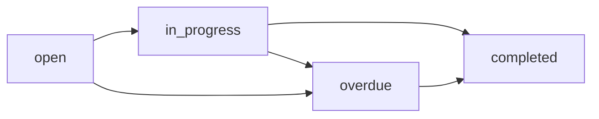

## Recommendation

Represents a maintenance recommendation with severity level, attachments, and status tracking.

```typescript
export interface Recommendation {
  id: string;
  title: string;
  severity: "low" | "medium" | "high" | "critical";
  description: string;
  attachments: RecommendationAttachment[];
  site: {
    id: string;
    name?: string;
  };
  asset: {
    id: string;
    name?: string;
  };
  sampling_point: {
    id: string;
    name?: string;
  };
  recommender: {
    id: string;
    name?: string;
  };
  status?: "open" | "in_progress" | "completed" | "overdue";
  created_at_datetime: string;
  updated_at_datetime: string;
}
```

### Fields

<ResponseField name="id" type="string" required>
  Unique identifier for the recommendation
</ResponseField>

<ResponseField name="title" type="string" required>
  Short title summarizing the recommendation
</ResponseField>

<ResponseField name="severity" type="'low' | 'medium' | 'high' | 'critical'" required>
  Severity level indicating urgency of the recommendation
  
  - `"low"`: Minor issue, can be addressed during routine maintenance
  - `"medium"`: Moderate issue, should be addressed soon
  - `"high"`: Significant issue, requires prompt attention
  - `"critical"`: Critical issue, immediate action required
</ResponseField>

<ResponseField name="description" type="string" required>
  Detailed description of the recommendation, including:
  - Problem identified
  - Recommended actions
  - Expected outcomes
  - Any relevant technical details
</ResponseField>

<ResponseField name="attachments" type="RecommendationAttachment[]" required>
  Array of attached files (images, PDFs, documents) supporting the recommendation
</ResponseField>

<ResponseField name="site" type="object" required>
  Reference to the site where action is needed
  
  <Expandable title="Site reference">
    <ResponseField name="id" type="string" required>
      Site ID
    </ResponseField>
    <ResponseField name="name" type="string">
      Site name (optional)
    </ResponseField>
  </Expandable>
</ResponseField>

<ResponseField name="asset" type="object" required>
  Reference to the asset requiring attention
  
  <Expandable title="Asset reference">
    <ResponseField name="id" type="string" required>
      Asset ID
    </ResponseField>
    <ResponseField name="name" type="string">
      Asset name (optional)
    </ResponseField>
  </Expandable>
</ResponseField>

<ResponseField name="sampling_point" type="object" required>
  Reference to the sampling point related to this recommendation
  
  <Expandable title="Sampling point reference">
    <ResponseField name="id" type="string" required>
      Sampling point ID
    </ResponseField>
    <ResponseField name="name" type="string">
      Sampling point name (optional)
    </ResponseField>
  </Expandable>
</ResponseField>

<ResponseField name="recommender" type="object" required>
  User who created the recommendation
  
  <Expandable title="Recommender reference">
    <ResponseField name="id" type="string" required>
      User ID
    </ResponseField>
    <ResponseField name="name" type="string">
      User's full name (optional)
    </ResponseField>
  </Expandable>
</ResponseField>

<ResponseField name="status" type="'open' | 'in_progress' | 'completed' | 'overdue'">
  Current status of the recommendation
  
  - `"open"`: New recommendation, no action taken yet
  - `"in_progress"`: Work has started on the recommendation
  - `"completed"`: Recommendation has been fully addressed
  - `"overdue"`: Recommendation has passed its due date without completion
</ResponseField>

<ResponseField name="created_at_datetime" type="string" required>
  ISO 8601 timestamp when recommendation was created
</ResponseField>

<ResponseField name="updated_at_datetime" type="string" required>
  ISO 8601 timestamp when recommendation was last updated
</ResponseField>

---

## RecommendationAttachment

Represents a file attachment associated with a recommendation.

```typescript
export interface RecommendationAttachment {
  type: string;
  url: string;
  name: string;
}
```

### Fields

<ResponseField name="type" type="string" required>
  MIME type or file type (e.g., "application/pdf", "image/jpeg", "image/png")
</ResponseField>

<ResponseField name="url" type="string" required>
  URL to access the attachment file
</ResponseField>

<ResponseField name="name" type="string" required>
  Original filename of the attachment
</ResponseField>

---

## AddRecommendationPayload

Payload for creating a new recommendation.

```typescript
export interface AddRecommendationPayload {
  title: string;
  severity: "low" | "medium" | "high" | "critical";
  description: string;
  attachments?: RecommendationAttachment[];
  site: {
    id: string;
  };
  asset: {
    id: string;
  };
  sampling_point: {
    id: string;
  };
  recommender: {
    id: string;
  };
}
```

### Fields

All fields match the `Recommendation` type except:
- `id`, `created_at_datetime`, `updated_at_datetime` are auto-generated
- `status` is automatically set to `"open"`
- `attachments` is optional
- Entity references require only `id` field

---

## EditRecommendationPayload

Payload for updating an existing recommendation.

```typescript
export interface EditRecommendationPayload {
  title: string;
  severity: "low" | "medium" | "high" | "critical";
  description: string;
  attachments?: RecommendationAttachment[];
  site: {
    id: string;
  };
  asset: {
    id: string;
  };
  sampling_point: {
    id: string;
  };
  recommender: {
    id: string;
  };
}
```

<Note>
  The `EditRecommendationPayload` has the same structure as `AddRecommendationPayload`. The recommendation ID is passed separately to the update function.
</Note>

---

## RecommendationAnalytics

Analytics data for recommendations over time.

```typescript
export interface RecommendationAnalytics {
  month: string;
  total_count: number;
  total_trend_percentage: number;
  overdue_count: number;
  overdue_trend_percentage: number;
  open_overdue_count: number;
  open_overdue_trend_percentage: number;
}
```

### Fields

<ResponseField name="month" type="string" required>
  Month identifier (e.g., "2024-01", "January 2024")
</ResponseField>

<ResponseField name="total_count" type="number" required>
  Total number of recommendations in this period
</ResponseField>

<ResponseField name="total_trend_percentage" type="number" required>
  Percentage change in total recommendations compared to previous period
</ResponseField>

<ResponseField name="overdue_count" type="number" required>
  Number of overdue recommendations
</ResponseField>

<ResponseField name="overdue_trend_percentage" type="number" required>
  Percentage change in overdue recommendations
</ResponseField>

<ResponseField name="open_overdue_count" type="number" required>
  Number of recommendations that are both open and overdue
</ResponseField>

<ResponseField name="open_overdue_trend_percentage" type="number" required>
  Percentage change in open/overdue recommendations
</ResponseField>

## Usage Example

```typescript
import type { 
  Recommendation, 
  AddRecommendationPayload,
  RecommendationAttachment 
} from '@/types';
import { createRecommendation } from '@/actions/recommendations';

// Create a new recommendation
const payload: AddRecommendationPayload = {
  title: 'Replace main bearing due to elevated copper levels',
  severity: 'high',
  description: `
    Oil sample analysis shows copper levels at 85 ppm, significantly above 
    the 50 ppm warning threshold. This indicates accelerated bearing wear.
    
    Recommended actions:
    1. Schedule immediate bearing inspection
    2. Replace bearing if wear is confirmed
    3. Investigate root cause of accelerated wear
    4. Re-sample 100 hours after replacement
  `,
  attachments: [
    {
      type: 'application/pdf',
      url: 'https://example.com/sample-report.pdf',
      name: 'Sample Report S-2024-001.pdf'
    },
    {
      type: 'image/jpeg',
      url: 'https://example.com/bearing-photo.jpg',
      name: 'bearing-inspection.jpg'
    }
  ],
  site: { id: 'site_123' },
  asset: { id: 'asset_456' },
  sampling_point: { id: 'sp_789' },
  recommender: { id: 'user_001' }
};

const result = await createRecommendation(payload);

if (result.success) {
  const recommendation: Recommendation = result.data;
  console.log(`Created: ${recommendation.title}`);
  console.log(`Severity: ${recommendation.severity}`);
  console.log(`Status: ${recommendation.status}`);
}
```

## Severity Guidelines

<Tabs>
  <Tab title="Low">
    **Low Severity**
    
    - Minor issues detected
    - Can wait for scheduled maintenance
    - No immediate risk to operations
    - Examples:
      - Slight increase in wear metals within acceptable range
      - Cosmetic issues
      - Documentation updates
  </Tab>
  
  <Tab title="Medium">
    **Medium Severity**
    
    - Moderate issues requiring attention
    - Should be addressed within 1-2 weeks
    - Potential for escalation if ignored
    - Examples:
      - Wear metals approaching warning thresholds
      - Minor contamination detected
      - Recommended preventive maintenance
  </Tab>
  
  <Tab title="High">
    **High Severity**
    
    - Significant issues requiring prompt action
    - Should be addressed within 2-3 days
    - Risk of equipment damage if delayed
    - Examples:
      - Wear metals exceeding warning thresholds
      - Significant contamination
      - Abnormal viscosity changes
  </Tab>
  
  <Tab title="Critical">
    **Critical Severity**
    
    - Immediate action required
    - Equipment may need to be taken offline
    - Risk of catastrophic failure
    - Examples:
      - Extreme wear metal levels
      - Major contamination (coolant, fuel)
      - Severe viscosity degradation
      - Active bearing failure indicators
  </Tab>
</Tabs>

## Status Workflow



1. **open**: Recommendation created, awaiting assignment or action
2. **in_progress**: Work has started on addressing the recommendation
3. **completed**: All recommended actions have been completed
4. **overdue**: Recommendation has passed its target completion date

<Warning>
  An overdue recommendation can still be marked as completed once the work is finished. The overdue status serves as a tracking metric for maintenance KPIs.
</Warning>

## Related Types

<CardGroup cols={2}>
  <Card title="Alarm Types" icon="bell" href="/api/types/alarms">
    Recommendations are often linked to alarms
  </Card>
  
  <Card title="Sample Types" icon="flask" href="/api/types/samples">
    Sample results trigger recommendations
  </Card>
</CardGroup>