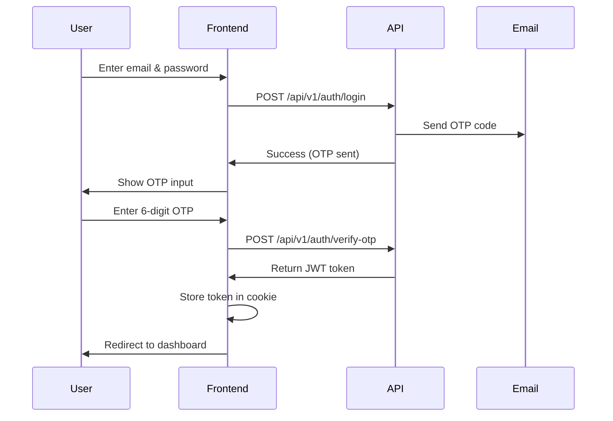

## Overview

MicroCBM uses a secure, token-based authentication system with email-based OTP (One-Time Password) verification. All authentication flows are protected by JWT tokens stored in HTTP-only cookies.

<Warning>
Login requires OTP verification via email. To complete end-to-end login, users must have access to their email inbox to receive the 6-digit verification code.
</Warning>

## Authentication Flow

### Login Process

The login flow consists of two steps:

1. **Credential submission** - User enters email and password
2. **OTP verification** - User enters 6-digit code sent to email



### Step 1: Login Service

From `src/app/actions/auth.ts`:

```typescript src/app/actions/auth.ts
export async function loginService(payload: {
  email: string;
  password: string;
}): Promise<ApiResponse> {
  return handleApiRequest(`${commonEndpoint}/login`, payload);
}
```

Used in the login form:

```typescript src/app/auth/components/Login.tsx
const onSubmit = async (data: FormData) => {
  const { email, password } = data;
  setErrorMessage("");

  const response = await loginService({
    email,
    password,
  });

  if (response.success) {
    toast.success("OTP sent", { description: `${response.data?.message}` });
    setUserEmail(email);
    setStep("otp");
  } else {
    setErrorMessage(response.message || "Login failed. Please try again.");
  }
};
```

### Step 2: OTP Verification

After receiving the OTP code via email:

```typescript src/app/actions/auth.ts
export async function verifyOTPService(formData: {
  email: string;
  otp: string;
}): Promise<ApiResponse> {
  const response = await handleApiRequest(`${commonEndpoint}/verify-otp`, {
    email: formData.email,
    otp: formData.otp,
  });

  if (response?.success) {
    const token =
      response.data?.data?.token ||
      response.data?.data?.access_token ||
      response.data?.token ||
      response.data?.access_token;

    if (token && typeof token === "string") {
      await createUserSession(token);
    } else {
      console.error("No token found in response:", response.data);
    }
  }

  return response;
}
```

Used in the OTP verification component:

```typescript src/app/auth/components/OTPVerification.tsx
const onSubmit = async (data: FormData) => {
  setErrorMessage("");
  setIsLoading(true);

  try {
    const response = await verifyOTPService({
      email,
      otp: data.otp,
    });

    if (response.success) {
      toast.success("OTP verified", {
        description: response.data?.message,
      });
      router.push(ROUTES.HOME);
    } else {
      toast.error(
        response.message || "OTP verification failed. Please try again."
      );
    }
  } finally {
    setIsLoading(false);
  }
};
```

<Info>
The OTP input auto-submits when the user enters all 6 digits, providing a seamless experience.
</Info>

## JWT Token Management

### Token Structure

JWT tokens contain the following payload:

```typescript src/libs/jwt.ts
export interface JWTPayload {
  user_id: string;
  email: string;
  role: string;
  role_id: string;
  permissions: string[];  // Array of permission strings
  org_id: string;         // Organization ID
  exp: number;            // Expiration timestamp
  iat: number;            // Issued at timestamp
}
```

### Token Utilities

The JWT library provides helper functions:

```typescript src/libs/jwt.ts
import { decodeJwt } from "jose";

export function decodeJWT(token: string): JWTPayload | null {
  try {
    const decoded = decodeJwt(token);
    return decoded as unknown as JWTPayload;
  } catch (error) {
    console.error("Error decoding JWT:", error);
    return null;
  }
}

export function isTokenExpired(token: string): boolean {
  const payload = decodeJWT(token);
  if (!payload) return true;

  const currentTime = Math.floor(Date.now() / 1000);
  return payload.exp < currentTime;
}

export function getTokenExpirationTime(token: string): Date | null {
  const payload = decodeJWT(token);
  if (!payload) return null;

  return new Date(payload.exp * 1000);
}
```

## Session Management

### Creating Sessions

When OTP verification succeeds, a session is created:

```typescript src/libs/session.ts
"use server";

export async function createUserSession(token: string) {
  const cookieStore = await cookies();

  // Decode token to get expiration time
  const tokenExpiration = getTokenExpirationTime(token);
  if (!tokenExpiration) {
    throw new Error("Invalid token format");
  }

  // Set cookie expiration to match token expiration (24 hours)
  const expiresAt = tokenExpiration;

  cookieStore.set("token", token, {
    httpOnly: true,
    secure: process.env.NODE_ENV === "production",
    expires: expiresAt,
    sameSite: "lax",
  });

  // Also store user data in a separate cookie for easy access
  const userData = decodeJWT(token);
  if (userData) {
    cookieStore.set("userData", JSON.stringify(userData), {
      httpOnly: true,
      secure: process.env.NODE_ENV === "production",
      expires: expiresAt,
      sameSite: "lax",
    });
  }
}
```

<Note>
Two cookies are created:
- `token` - The raw JWT token for API authentication
- `userData` - Decoded user data for quick access (role, permissions, etc.)

Both are HTTP-only to prevent XSS attacks.
</Note>

### Retrieving Sessions

```typescript src/libs/session.ts
export async function getUserSession() {
  const cookieStore = await cookies();
  const token = cookieStore.get("token")?.value;

  if (!token) return null;

  // Check if token is expired
  if (isTokenExpired(token)) {
    await logoutUserSession();
    return null;
  }

  // Get user data from cookie
  const userDataCookie = cookieStore.get("userData")?.value;
  let userData: SessionUser | null = null;

  if (userDataCookie) {
    try {
      userData = JSON.parse(userDataCookie);
    } catch (error) {
      console.error("Error parsing user data:", error);
    }
  }

  // If user data is not available, decode from token
  if (!userData) {
    userData = decodeJWT(token);
  }

  return {
    token,
    user: userData,
  };
}

export async function getCurrentUser(): Promise<SessionUser | null> {
  const session = await getUserSession();
  return session?.user || null;
}
```

### Logging Out

```typescript src/libs/session.ts
export async function logoutUserSession() {
  const cookieStore = await cookies();
  cookieStore.delete("token");
  cookieStore.delete("userData");
  redirect("/auth/login");
}
```

## Middleware Protection

All routes are protected by Next.js middleware that runs before every request:

```typescript src/middleware.ts
const publicPaths = new Set([
  ROUTES.AUTH.LOGIN,
  ROUTES.AUTH.REGISTER,
  ROUTES.AUTH.RESET_PASSWORD,
]);

function isPublicPath(pathname: string): boolean {
  return publicPaths.has(pathname) || pathname.startsWith("/auth/");
}

export default async function middleware(req: NextRequest) {
  const { pathname } = req.nextUrl;
  const token = req.cookies.get("token")?.value;
  const isPublic = isPublicPath(pathname);

  // If token is expired, clear cookies and redirect to login
  if (token && isTokenExpired(token)) {
    const response = isPublic
      ? NextResponse.next()
      : NextResponse.redirect(new URL(ROUTES.AUTH.LOGIN, req.nextUrl));
    response.cookies.delete("token");
    response.cookies.delete("userData");
    return response;
  }

  // Redirect to login if accessing protected route without token
  if (!isPublic && !token) {
    return NextResponse.redirect(new URL(ROUTES.AUTH.LOGIN, req.nextUrl));
  }

  // Redirect to home if accessing auth pages with valid token
  if (isPublic && token) {
    return NextResponse.redirect(new URL(ROUTES.HOME, req.nextUrl));
  }

  return NextResponse.next();
}

export const config = {
  matcher: [
    "/((?!api|_next/static|_next/image|assets|favicon.ico|robots.txt|sitemap.xml|manifest.webmanifest).*)",
  ],
};
```

### Middleware Features

1. **Automatic token validation** on every request
2. **Cookie cleanup** when tokens expire
3. **Smart redirects** based on authentication state
4. **Static asset exclusion** for performance

<Warning>
The middleware runs on EVERY request. Keep it lightweight to avoid performance issues.
</Warning>

## Password Reset Flow

Similar to login, password reset uses OTP verification:

### Step 1: Request Reset

```typescript src/app/actions/auth.ts
export async function requestPasswordResetService(
  email: string
): Promise<ApiResponse> {
  return handleApiRequest(`${commonEndpoint}/request-password-reset`, {
    email: email,
  });
}
```

### Step 2: Verify Reset OTP

```typescript src/app/actions/auth.ts
export async function verifyPasswordResetOTPService(
  email: string,
  otp: string
): Promise<ApiResponse> {
  return handleApiRequest(`${commonEndpoint}/verify-reset-otp`, {
    email: email,
    otp: otp,
  });
}
```

### Step 3: Reset Password

```typescript src/app/actions/auth.ts
export async function resetPasswordService(payload: {
  email: string;
  password: string;
}): Promise<ApiResponse> {
  return handleApiRequest(`${commonEndpoint}/reset-password`, payload);
}
```

## User Registration

New users register with organization details:

```typescript src/app/actions/auth.ts
export async function signupService(formData: {
  user: {
    first_name: string;
    last_name: string;
    email: string;
  };
  organization: {
    name: string;
    industry: string;
    team_strength: string;
    logo_url: string;
  };
  password: string;
}): Promise<ApiResponse> {
  return handleApiRequest(`${commonEndpoint}/signup`, {
    user: formData.user,
    organization: formData.organization,
    password: formData.password,
  });
}
```

<Info>
After registration, users must verify their email with an OTP code before they can log in.
</Info>

## Permission-Based Access

Permissions are embedded in the JWT token and checked throughout the application:

### Server-Side Checks

```typescript
const currentUser = await getCurrentUser();
if (!currentUser?.permissions.includes("assets:write")) {
  return { success: false, message: "Unauthorized" };
}
```

### Client-Side Guards

```typescript
<ComponentGuard
  permissions="dashboard:read"
  unauthorizedFallback={<div>Access Denied</div>}
>
  <DashboardContent />
</ComponentGuard>
```

### Common Permissions

- `dashboard:read` - View dashboard
- `assets:read` / `assets:write` - Asset management
- `samples:read` / `samples:write` - Sample management
- `alarms:read` / `alarms:write` - Alarm monitoring
- `users:read` / `users:write` - User management

## Security Best Practices

<CardGroup cols={2}>
  <Card title="HTTP-Only Cookies" icon="shield-check">
    Tokens are stored in HTTP-only cookies to prevent XSS attacks
  </Card>
  <Card title="Secure Flag" icon="lock">
    Production cookies use the `secure` flag for HTTPS-only transmission
  </Card>
  <Card title="SameSite Protection" icon="ban">
    `sameSite: 'lax'` prevents CSRF attacks
  </Card>
  <Card title="Token Expiration" icon="clock">
    Tokens expire after 24 hours and are automatically validated
  </Card>
</CardGroup>

## Backend API Integration

All authentication requests go through the helper function:

```typescript src/app/actions/helpers.ts
export async function requestWithAuth(
  input: RequestInfo,
  init?: RequestInit,
): Promise<Response> {
  const token = (await cookies()).get("token")?.value;
  const headers = new Headers(init?.headers || {});
  headers.set("Content-Type", "application/json");
  if (token) {
    headers.set("Authorization", `Bearer ${token}`);
  }
  const requestInit: RequestInit = { ...init, headers };
  const url = `${process.env.NEXT_PUBLIC_API_URL}${input}`;

  return fetch(url, requestInit);
}
```

<Note>
The backend API URL is configured via the `NEXT_PUBLIC_API_URL` environment variable. The backend may require 30-60 seconds for cold start on free tier hosting.
</Note>

## Troubleshooting

### Token Not Found

If you see "No token found in response" errors, check:
1. Backend API is running and accessible
2. OTP verification endpoint returns a valid token
3. Token format matches expected structure

### Automatic Logout

Users are automatically logged out when:
1. Token expires (after 24 hours)
2. Token is invalid or malformed
3. Middleware detects an expired token

### OTP Not Received

If OTP emails aren't arriving:
1. Check spam/junk folder
2. Verify backend email service is configured
3. Wait 10 seconds before requesting a new code

## Related Resources

<CardGroup cols={2}>
  <Card title="System Architecture" href="/concepts/architecture" icon="sitemap">
    Learn about the overall application architecture
  </Card>
  <Card title="Data Flow" href="/concepts/data-flow" icon="arrow-right-arrow-left">
    Understand how data flows through the application
  </Card>
  <Card title="Environment Setup" href="/development/environment-setup" icon="gear">
    Configure authentication environment variables
  </Card>
  <Card title="Security" href="/deployment/security" icon="shield">
    Security best practices for deployment
  </Card>
</CardGroup>