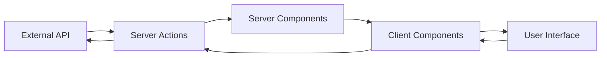
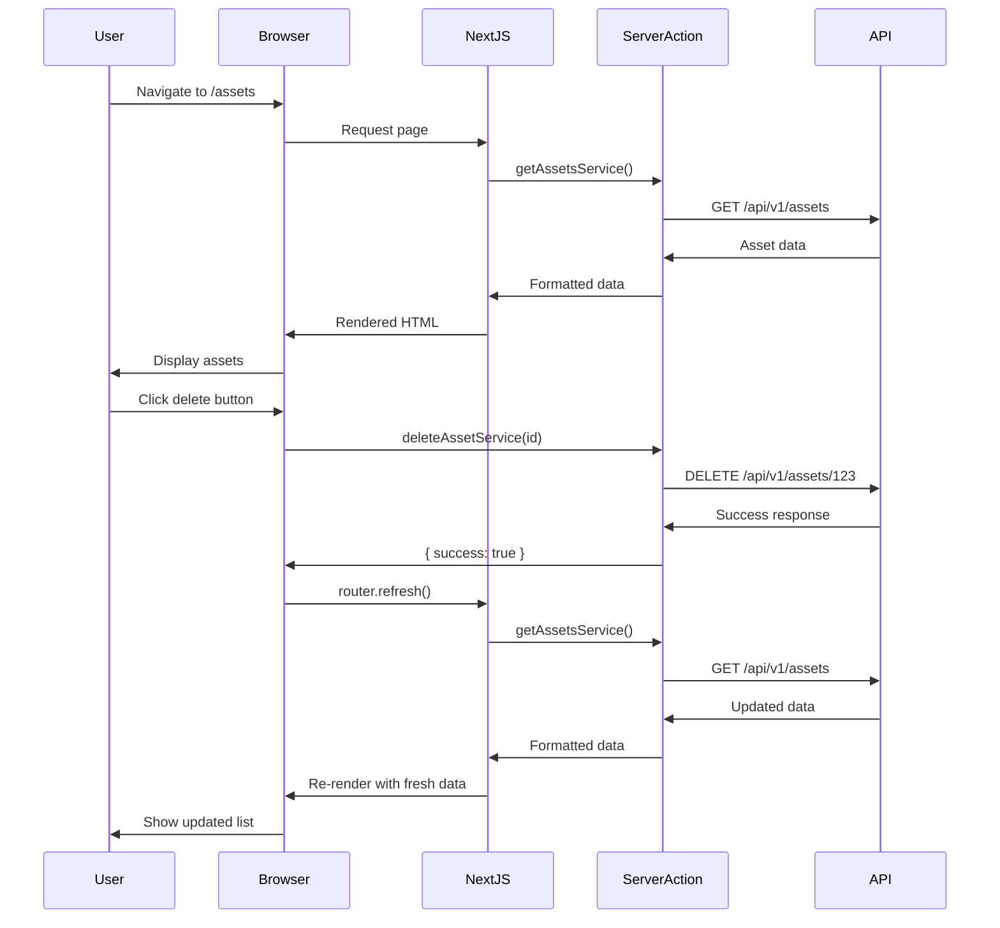

## Overview

MicroCBM follows a modern data flow architecture using Next.js 15's App Router with React Server Components and Server Actions. All data originates from an external REST API and flows through a well-defined pipeline to reach the UI.

## High-Level Architecture



## Data Flow Layers

### 1. API Layer

**Location**: External REST API at `NEXT_PUBLIC_API_URL`

All data originates from the backend API. MicroCBM does not have its own database or backend services.

<Info>
The backend API may require 30-60 seconds for cold start on first request when hosted on free tier services.
</Info>

### 2. Server Actions Layer

**Location**: `src/app/actions/`

Server Actions handle all API communication. They run exclusively on the server and provide type-safe data fetching.

#### Request Helper

All requests use the `requestWithAuth` helper:

```typescript src/app/actions/helpers.ts
export async function requestWithAuth(
  input: RequestInfo,
  init?: RequestInit,
): Promise<Response> {
  const token = (await cookies()).get("token")?.value;
  const headers = new Headers(init?.headers || {});
  headers.set("Content-Type", "application/json");
  if (token) {
    headers.set("Authorization", `Bearer ${token}`);
  }
  const requestInit: RequestInit = { ...init, headers };
  const url = `${process.env.NEXT_PUBLIC_API_URL}${input}`;

  return fetch(url, requestInit);
}
```

**Key Features**:
- Automatic JWT token injection from cookies
- Centralized API URL configuration
- Consistent header management

#### API Request Handler

```typescript src/app/actions/helpers.ts
export async function handleApiRequest(
  endpoint: string,
  body: unknown,
  method: "POST" | "GET" | "PUT" | "DELETE" | "PATCH" = "POST",
): Promise<ApiResponse> {
  try {
    const res = await requestWithAuth(endpoint, {
      method,
      body: body ? JSON.stringify(body) : undefined,
    });

    const responseText = await res.text();

    let data: Record<string, unknown> | undefined;
    try {
      data = responseText ? JSON.parse(responseText) : undefined;
    } catch {
      // Success status with empty/invalid body still counts as success
      if (res.ok) {
        return { success: true, data: undefined };
      }
      return {
        success: false,
        statusCode: res.status,
        message: "Invalid response from server.",
      };
    }

    if (res.ok) {
      return { success: true, data };
    } else {
      return {
        success: false,
        statusCode: res.status,
        message: (data?.message as string) || "Request failed",
      };
    }
  } catch (error: unknown) {
    return handleError(error);
  }
}
```

**Features**:
- Unified error handling
- Response validation
- Type-safe return values

### 3. Server Components Layer

**Location**: `src/app/(home)/` pages

Server Components fetch data and render on the server. They can directly call Server Actions.

#### Example: Dashboard Page

From `src/app/(home)/page.tsx`:

```typescript src/app/(home)/page.tsx
"use server";

export default async function Page() {
  // Get current user from session
  const currentUser = await getCurrentUser();

  // Fetch all data in parallel
  const [
    sites,
    assets,
    assetsAnalytics,
    organizations,
    samplingPoints,
    alarmsAnalytics,
    recommendationsAnalyticsArray,
    samples,
    recommendations,
    users,
  ] = await Promise.all([
    getSitesService().then((r) => r.data).catch(() => []),
    getAssetsService().then((r) => r.data).catch(() => []),
    getAssetsAnalyticsService().catch(() => null),
    getOrganizationsService().then((r) => r.data).catch(() => []),
    getSamplingPointsService().then((r) => r.data).catch(() => []),
    getAlarmsAnalyticsService().catch(() => null),
    getRecommendationAnalyticsService().catch(() => []),
    getSamplesService().then((r) => r.data).catch(() => []),
    getRecommendationsService({}).catch(() => []),
    getUsersService().catch(() => []),
  ]);

  // Process and transform data
  const severityLevels = calculateRecommendationSeverityDistribution(recommendations);
  const contaminantsData = aggregateContaminants(samples);

  return (
    <ComponentGuard permissions="dashboard:read">
      <main className="flex flex-col gap-4">
        <Summary
          assetsAnalytics={assetsAnalytics}
          alarmsAnalytics={alarmsAnalytics}
          recommendationsAnalytics={recommendationsAnalytics}
        />
        <LineChart samples={samples} />
        <SeverityCard data={severityCardData} />
        <PieChart data={contaminantsData} />
      </main>
    </ComponentGuard>
  );
}
```

**Benefits**:
- Parallel data fetching with `Promise.all()`
- Graceful error handling with `.catch()`
- Data transformation before rendering
- Zero client-side JavaScript for data fetching

### 4. Client Components Layer

**Location**: Throughout `src/components/` and page-specific components

Client Components handle interactivity, user input, and dynamic updates.

#### Client-Side Data Fetching

For interactive features, Client Components can call Server Actions:

```typescript
"use client";

const onSubmit = async (data: FormData) => {
  const response = await loginService({
    email: data.email,
    password: data.password,
  });

  if (response.success) {
    toast.success("OTP sent");
    setStep("otp");
  } else {
    setErrorMessage(response.message);
  }
};
```

## Data Flow Patterns

### Pattern 1: Server-Side Rendering (SSR)

Used for initial page loads and SEO-critical content.

```typescript
// Server Component
export default async function AssetsPage() {
  const { data: assets } = await getAssetsService();
  return <AssetList assets={assets} />;
}
```

**Flow**:
1. User requests page
2. Server Component calls Server Action
3. Server Action fetches from API
4. Page renders on server with data
5. HTML sent to browser

### Pattern 2: Client-Side Mutations

Used for form submissions and user actions.

```typescript
// Client Component
"use client";

const handleDelete = async (id: string) => {
  const response = await deleteAssetService(id);
  if (response.success) {
    toast.success("Asset deleted");
    router.refresh(); // Revalidate server data
  }
};
```

**Flow**:
1. User clicks delete button
2. Client Component calls Server Action
3. Server Action sends DELETE request to API
4. Response returned to client
5. Client updates UI and revalidates

### Pattern 3: Optimistic Updates

Used for immediate feedback on user actions.

```typescript
// Client Component with optimistic update
const handleAcknowledge = async (alarmId: string) => {
  // Optimistically update UI
  setAlarms(alarms.map(a => 
    a.id === alarmId ? { ...a, status: 'acknowledged' } : a
  ));

  // Send request to server
  const response = await acknowledgeAlarmService(alarmId);
  
  if (!response.success) {
    // Revert on failure
    setAlarms(previousAlarms);
    toast.error("Failed to acknowledge alarm");
  }
};
```

### Pattern 4: Paginated Data

Used for large datasets like asset lists.

```typescript src/app/actions/inventory.ts
async function getAssetsService(params?: {
  page?: number;
  limit?: number;
  search?: string;
}): Promise<GetAssetsResult> {
  try {
    const searchParams = new URLSearchParams();
    if (params?.page != null) searchParams.set("page", String(params.page));
    if (params?.limit != null) searchParams.set("limit", String(params.limit));
    if (params?.search) searchParams.set("search", String(params.search));
    
    const url = `${commonEndpoint}assets${searchParams.toString() ? `?${searchParams.toString()}` : ""}`;
    const response = await requestWithAuth(url, { method: "GET" });

    if (response.status === 403) {
      console.warn("User does not have permission to access assets");
      return { 
        data: [], 
        meta: { page: 1, limit: 10, total: 0, total_pages: 0, has_next: false, has_prev: false } 
      };
    }

    const json = await response.json();
    return {
      data: Array.isArray(json?.data) ? json.data : [],
      meta: json?.meta ?? { page: 1, limit: 10, total: 0, total_pages: 0, has_next: false, has_prev: false }
    };
  } catch (error) {
    console.error("Error fetching assets:", error);
    return { data: [], meta: { page: 1, limit: 10, total: 0, total_pages: 0, has_next: false, has_prev: false } };
  }
}
```

**Response Structure**:
```typescript
interface GetAssetsResult {
  data: Asset[];
  meta: {
    page: number;
    limit: number;
    total: number;
    total_pages: number;
    has_next: boolean;
    has_prev: boolean;
  };
}
```

## Error Handling

### API-Level Errors

```typescript src/app/actions/helpers.ts
export function handleError(error: unknown): ApiResponse {
  if (!(error instanceof Error)) {
    return {
      success: false,
      statusCode: 500,
      message: "An unexpected error occurred.",
    };
  }

  if (error.name === "AbortError") {
    return {
      success: false,
      statusCode: 408,
      message: "Request timeout. Please try again.",
    };
  }

  const errorCode = (error as NodeJS.ErrnoException).code;
  if (errorCode === "ENOTFOUND" || errorCode === "ECONNREFUSED") {
    return {
      success: false,
      statusCode: 503,
      message: "Unable to connect to server. Please try again later.",
    };
  }

  return {
    success: false,
    statusCode: 500,
    message: error.message || "An unexpected error occurred.",
  };
}
```

### Permission Errors

```typescript
if (response.status === 403) {
  console.warn("User does not have permission to access assets");
  return { 
    data: [], 
    meta: { /* default pagination */ } 
  };
}
```

### Component-Level Error Handling

```typescript
<ComponentGuard
  permissions="dashboard:read"
  loadingFallback={<div>Loading...</div>}
  unauthorizedFallback={
    <div>You do not have permission to view the dashboard.</div>
  }
>
  <DashboardContent />
</ComponentGuard>
```

## State Management

### Server State

Managed by React Server Components and Server Actions. Data is fetched on the server and passed to components.

```typescript
// No state management library needed
const assets = await getAssetsService();
```

### Client State

#### Form State (React Hook Form)

```typescript
const { handleSubmit, register, formState: { errors } } = useForm<FormData>({
  resolver: zodResolver(schema),
});
```

#### UI State (useState)

```typescript
const [isModalOpen, setIsModalOpen] = useState(false);
const [selectedAsset, setSelectedAsset] = useState<Asset | null>(null);
```

#### Global State (Zustand)

Used sparingly for truly global state:

```typescript
// Store definition
const useStore = create((set) => ({
  theme: 'light',
  setTheme: (theme: string) => set({ theme }),
}));

// Usage
const { theme, setTheme } = useStore();
```

### LocalStorage State

<Warning>
The RCA (Root Cause Analysis) module stores data in browser `localStorage`, NOT via the backend API. This is a special case.
</Warning>

```typescript
// RCA data persistence
const saveRcaRecord = (record: RcaRecord) => {
  const records = JSON.parse(localStorage.getItem('rcaRecords') || '[]');
  records.push(record);
  localStorage.setItem('rcaRecords', JSON.stringify(records));
};
```

## Data Transformation

### Server-Side Transformation

Data is often transformed before passing to components:

```typescript src/app/(home)/page.tsx
// Aggregate contaminants from samples
function aggregateContaminants(
  samples: Array<{ contaminants?: Array<{ type: string; value: number }> }>
) {
  const contaminantMap: Record<string, number> = {};
  const colors = [
    "#3B82F6", "#10B981", "#F59E0B", "#EF4444", 
    "#8B5CF6", "#06B6D4", "#F97316", "#EC4899"
  ];

  samples.forEach((sample) => {
    if (sample.contaminants && Array.isArray(sample.contaminants)) {
      sample.contaminants.forEach((contaminant) => {
        const type = contaminant.type || "Unknown";
        contaminantMap[type] = (contaminantMap[type] || 0) + 1;
      });
    }
  });

  // Convert to array and sort by value
  const contaminants = Object.entries(contaminantMap)
    .map(([name, value], index) => ({
      name: formatContaminantName(name),
      value,
      color: colors[index % colors.length],
    }))
    .sort((a, b) => b.value - a.value)
    .slice(0, 5); // Top 5 contaminants

  return contaminants;
}
```

### Client-Side Transformation

For dynamic, interactive transformations:

```typescript
const filteredAssets = useMemo(() => {
  return assets.filter(asset => {
    if (filters.status && asset.status !== filters.status) return false;
    if (filters.site && asset.site_id !== filters.site) return false;
    if (filters.search && !asset.name.toLowerCase().includes(filters.search.toLowerCase())) return false;
    return true;
  });
}, [assets, filters]);
```

## Caching Strategy

### Server-Side Caching

Next.js automatically caches Server Component fetches:

```typescript
// Revalidate every 60 seconds
export const revalidate = 60;

export default async function Page() {
  const data = await getAssetsService();
  return <AssetList assets={data} />;
}
```

### Manual Revalidation

Trigger revalidation after mutations:

```typescript
import { revalidatePath } from 'next/cache';

export async function deleteAssetAction(id: string) {
  const response = await deleteAssetService(id);
  if (response.success) {
    revalidatePath('/assets');
  }
  return response;
}
```

### Client-Side Refresh

Force refresh from client:

```typescript
import { useRouter } from 'next/navigation';

const router = useRouter();
const handleUpdate = async () => {
  await updateAssetService(data);
  router.refresh(); // Refetch server data
};
```

## Performance Optimization

### Parallel Data Fetching

```typescript
const [data1, data2, data3] = await Promise.all([
  getAssetsService(),
  getSitesService(),
  getSamplesService(),
]);
```

### Selective Data Loading

```typescript
// Only load what's needed
const { data: assets } = await getAssetsService({
  page: 1,
  limit: 10,
  fields: ['id', 'name', 'status'], // Backend support required
});
```

### Streaming with Suspense

```typescript
import { Suspense } from 'react';

export default function Page() {
  return (
    <main>
      <Suspense fallback={<Skeleton />}>
        <AssetList />
      </Suspense>
      <Suspense fallback={<Skeleton />}>
        <SampleChart />
      </Suspense>
    </main>
  );
}
```

## Data Flow Diagram



## Type Safety

All data flows are type-safe using TypeScript:

```typescript
// Type definitions
interface Asset {
  id: string;
  name: string;
  status: string;
  site_id: string;
  created_at: string;
}

// Server Action
async function getAssetsService(): Promise<GetAssetsResult> {
  // Implementation
}

// Component
interface AssetListProps {
  assets: Asset[];
}

function AssetList({ assets }: AssetListProps) {
  // TypeScript ensures assets is Asset[]
}
```

## Related Resources

<CardGroup cols={2}>
  <Card title="System Architecture" href="/concepts/architecture" icon="sitemap">
    Learn about the overall application architecture
  </Card>
  <Card title="Authentication Flow" href="/concepts/authentication" icon="lock">
    Understand JWT tokens and session management
  </Card>
  <Card title="Server Actions" href="/api/actions/overview" icon="server">
    Explore available Server Actions
  </Card>
  <Card title="State Management" href="/development/state-management" icon="database">
    Deep dive into state management patterns
  </Card>
</CardGroup>