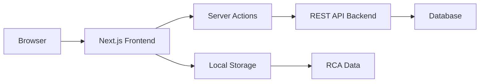

## What is MicroCBM?

MicroCBM is a Next.js 15 frontend application built for Condition-Based Maintenance (CBM) platforms. It provides a comprehensive solution for organizations to monitor equipment health, track oil sample analysis, manage alarms, and perform root cause analysis using proven methodologies.

The platform connects to a RESTful backend API and leverages modern React patterns including Server Actions, Server Components, and advanced state management to deliver a fast, reliable user experience.

## Key Features

<CardGroup cols={2}>
  <Card
    title="Asset Management"
    icon="boxes-stacked"
    href="/features/asset-management"
  >
    Track equipment inventory with detailed maintenance history, specifications, and lifecycle management across multiple sites.
  </Card>
  <Card
    title="Oil Sample Analysis"
    icon="flask"
    href="/features/oil-sample-analysis"
  >
    Monitor wear metals, contaminants, particle counts, and viscosity measurements to predict equipment failures before they occur.
  </Card>
  <Card
    title="Alarm Monitoring"
    icon="bell"
    href="/features/alarm-monitoring"
  >
    Real-time alarm system with acknowledgment workflow, severity tracking, and direct linking to maintenance recommendations.
  </Card>
  <Card
    title="Root Cause Analysis"
    icon="sitemap"
    href="/features/root-cause-analysis"
  >
    Investigate failures using 5 Whys, Logic Tree, and Fishbone diagram templates with persistent browser storage.
  </Card>
  <Card
    title="Multi-Organization Support"
    icon="building"
    href="/features/organizations-sites"
  >
    Manage multiple organizations and sites with role-based access control and department-level permissions.
  </Card>
  <Card
    title="Dashboard Analytics"
    icon="chart-line"
    href="/features/asset-management"
  >
    Visualize trends with interactive charts for assets, alarms, recommendations, and oil analysis data with forecasting capabilities.
  </Card>
</CardGroup>

## Technology Stack

MicroCBM is built with modern web technologies:

- **Framework**: Next.js 15 with App Router
- **Language**: TypeScript with strict type checking
- **UI Library**: React 19 with Server Components
- **State Management**: Zustand and TanStack Query
- **Forms**: React Hook Form with Zod validation
- **Styling**: Tailwind CSS 4 with custom SCSS modules
- **Components**: Radix UI primitives with custom design system
- **Charts**: Recharts for data visualization
- **Authentication**: JWT-based with OTP verification

## Architecture Overview

MicroCBM follows a client-server architecture:

<Note>
  MicroCBM is a frontend-only application. All business logic and data persistence are handled by the external REST API configured via `NEXT_PUBLIC_API_URL`.
</Note>

## Use Cases

MicroCBM is designed for organizations that need to:

- **Predict Equipment Failures**: Use oil analysis trends to detect early warning signs of wear and contamination
- **Manage Maintenance Programs**: Track recommendations, assign work orders, and monitor completion status
- **Analyze Historical Data**: Review sample history and alarm patterns to identify recurring issues
- **Collaborate Across Teams**: Share insights between operations, maintenance, and engineering departments
- **Ensure Compliance**: Document maintenance activities and maintain audit trails for regulatory requirements

## Core Concepts

Before diving in, familiarize yourself with these key concepts:

<CardGroup cols={2}>
  <Card title="Authentication Flow" icon="lock" href="/concepts/authentication">
    Learn about JWT tokens, OTP verification, and session management
  </Card>
  <Card title="Data Flow" icon="arrows-turn-to-dots" href="/concepts/data-flow">
    Understand how data moves between components, Server Actions, and the API
  </Card>
  <Card title="Architecture" icon="diagram-project" href="/concepts/architecture">
    Explore the application structure and design patterns
  </Card>
  <Card title="Permissions" icon="user-shield" href="/features/user-management">
    Discover role-based access control and permission checking
  </Card>
</CardGroup>

## Getting Started

Ready to start? Follow our quickstart guide to set up MicroCBM in minutes:

<Card title="Quickstart Guide" icon="rocket" href="/quickstart">
  Get up and running with MicroCBM in under 5 minutes
</Card>

For detailed setup instructions including environment variables and deployment options:

<Card title="Installation Guide" icon="download" href="/installation">
  Complete installation and configuration documentation
</Card>

## Community and Support

Need help or want to contribute?

- **Documentation**: You're reading it! Use the search bar to find specific topics
- **Issues**: Report bugs or request features on GitHub
- **Updates**: Follow release notes for new features and improvements

<Note>
  This documentation covers the frontend application. For API documentation, backend setup, or database schema details, refer to your organization's backend documentation.
</Note>